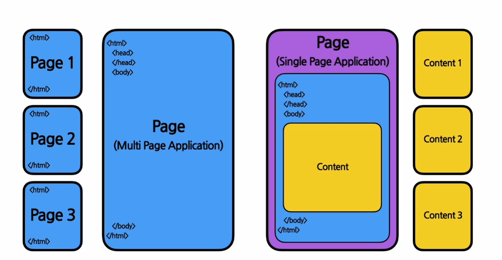
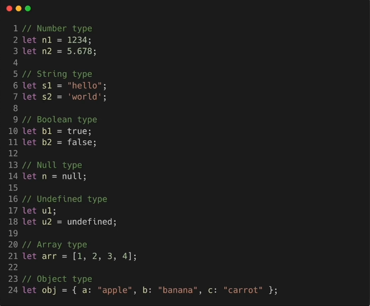

#  프론트엔드 스터디 1주차
##  HTML(Hyper Text Markup Languade)
마크업 언어의 한 종류(태그 등을 이용하여 문서나 데이터의 구조를 명기하는 언어)
웹 사이트의 뼈대를 구성하기 위해 사용하는 언어

태그<html> </html> ( html 소스의 가장 기본적인 태그 )
식으로 사용
태그는 열었으면 꼭 닫아주어야 함 !
head태그에는 웹 사이트의 속성(제목, 설명 등. 메타데이터라고 함)
body태그에는 헤드태그 다음에 나오며 실제 컨텐츠가 나옴

### SPA(Single Page Application)
하나의 페이지만 존재하는 웹사이트, 웹 애플리케이션
-> 리액트와 관련됨

페이지가 하나 = HTML 파일이 하나라는 것 -> 리액트가 content를 채우는 역할(이후에 배움)

##CSS(Cascading Style Sheets)
CSS를 사용하여 디자인을 입힐 수 있음

##JavaScript(ECMAScript)
동적인 작업을 하기위해 사용하는 프로그래밍 언어, 웹 사이트의 생명을 불어넣는 역할

### Script Language
컴파일언어와 달리 프로그램이 실행되는 런타임에 코드가 해석된다.
ES5, ES6 등 표준이 있음

## JavaScript의 문법
#### 자료형(Data Type)
변수의 데이터가 대입되는 시점에 동적으로(Dynamic Typing) 자료형이 결정됨
var , let 등으로 변수 선언

변수의 값이 대입되는 순간 동적 타이핑 방식으로 해당 변수의 자료형이 결정된다
undefined는 정의되지 않은 상태, null은 정의되었지만 값이 null인 상태
object 타입 - 객체를 다루기 위한 자료형
* JS에서의 객체 : 키와 밸류로 이루어진 쌍의 집합을 의미

## 연산자(Operator)
* 대입연산자 =
* 산술연산자 + - * /(나눗셈) %(나머지) **(지수)
* 증감연산자 ++ -- postfix(증감 전의 값을 반환하고 증감), prefix(변수의 값을 증감시키고, 증감된 변수의 값을 반환)
* 관계연산자(비교연산자) <,>,<=,>=
* 동등연산자 == !=
* 일치연산자 === !=== (자료형까지 같은지를 검사)
* 이진논리연산자 &&(모두 true) ||(하나라도 true)
* 조건부연산자(삼항연산자) 조건식 ? true일경우 : false일경우

## 함수(function)
입력(파라미터, 인자)을 받아 결과 return
리액트의 컴포넌트 중에서 함수 컴포넌트가 하나의 자바스크림트 함수라는 사실을 기억하자 !

## 개발환경 설정
* Node.js - 자바스크립트로 네트워크 애플리케이션을 개발할 수 있게 해주는 환경
* npm(Node Package Manager) - node.js를 위한 패키지 매니저. 프로젝트에서 필요로 하는 다양한 외부 패키지들의 버전과 의존성 관리, 설치 및 삭제
* VS Code - IDE(Integrated Development Environment) 통합 개발 환경

## 리액트
사용자 인터페이스를 만들기 위한 자바스크립트 라이브러리
#### 라이브러리
자주 사용되는 기능들을 정리해 모아 놓은 것
#### 사용자 인터페이스(UI)
웹사이트에서 사용자와 상호작용 하는 것. 리액트는 UI 라이브러리
#### 프레임워크 VS 라이브러리
프레임워크 - 흐름의 제어 권한을 개발자가 아닌 프레임워크가 가짐
라이브러리 - 흐름에 대한 제어를 하지 않고 개발자가 필요한 부분만 필요할 때 가져다 사용
#### 리액트의 장점
* 빠른 업데이트 & 랜더링 속도 - virtual DOM 사용하여 업데이트해야 하는 최소한의 부분만을 업데이트함
* Component-Based - 레고 블록 조립하듯 컴포넌트들을 모아서 개발
* 재사용성(Reusability) - 개발이 편리하고 유지 보수가 용이
* Meta가 만든 오픈소스 프로젝트이기 때문에, 많은 자본 보유
* 활발한 지식공유 & 커뮤니티 - 굉장히 많은 사람들이 사용, 관심
* 리액트 네이티브를 통해 모바일 환경 개발 가능

#### 리액트 실습
cd my -app 현재 커맨드라인 도구가 위치한 경로 변경
npm uninstall -g create-react-app (리액트 앱 제거)
npm install -g create-react-app (리액트 앱 재설치)
npx create-react-app [app-name] (리액트 앱 실행)
npm start (리액트 실행)

#### JSX(A syntax extension to Javascript)
자바스크립트 확장 문법(JavaScript + XML/HTML)
```const element = <h1>Hello, world!</h1>```
이런식으로 element라는 변수에 HTML코드를 대입하는 코드 등이 JSX 코드
createElement : JSX코드를 JavaScript코드로 변환하는 역할, 인자로 type, props, chlidren 등이 들어감 
따로 createElement를 일일히 써주면 귀찮으니까 JSX코드를 사용
가독성이 쉬워지고, 간결해지고, Injection Attacks라는 공격을 방어할 수 있음(보안에 강함)
HTML 코드 중간에 {}중괄호를 통해 자바스크립트 변수나 함수 사용

#### Elements
리액트 앱을 구성하는 가장 작은 블록들
화면에서 보이는 것들을 기술, 자바스크립트 객체 형태로 존재 - 한번 생성되면 바꿀 수 없음(불변성)
-> Elements 생성후에는 children이나 attributes를 바꿀 수 없다.
React엘리먼트 - React의 Virtual DOM에 존재
DOM엘리먼트 - 실제 브라우저의 DOM에 존재
* 엘리먼트를 업데이트하기 위해서는 새로 만들어야 함 ! (불변성)
