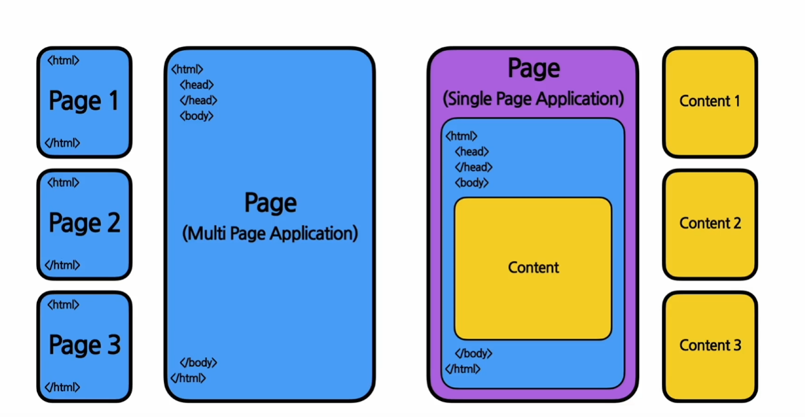

#  프론트엔드 스터디 1주차
##  HTML(Hyper Text Markup Languade)
마크업 언어의 한 종류(태그 등을 이용하여 문서나 데이터의 구조를 명기하는 언어)
웹 사이트의 뼈대를 구성하기 위해 사용하는 언어

태그<html> </html> ( html 소스의 가장 기본적인 태그 )
식으로 사용
태그는 열었으면 꼭 닫아주어야 함 !
head태그에는 웹 사이트의 속성(제목, 설명 등. 메타데이터라고 함)
body태그에는 헤드태그 다음에 나오며 실제 컨텐츠가 나옴

### SPA(Single Page Application)
하나의 페이지만 존재하는 웹사이트, 웹 애플리케이션
-> 리액트와 관련됨

페이지가 하나 = HTML 파일이 하나라는 것 -> 리액트가 content를 채우는 역할(이후에 배움)

##CSS(Cascading Style Sheets)
CSS를 사용하여 디자인을 입힐 수 있음

##JavaScript(ECMAScript)
동적인 작업을 하기위해 사용하는 프로그래밍 언어, 웹 사이트의 생명을 불어넣는 역할

### Script Language
컴파일언어와 달리 프로그램이 실행되는 런타임에 코드가 해석된다.
ES5, ES6 등 표준이 있음

##JavaScript의 문법
