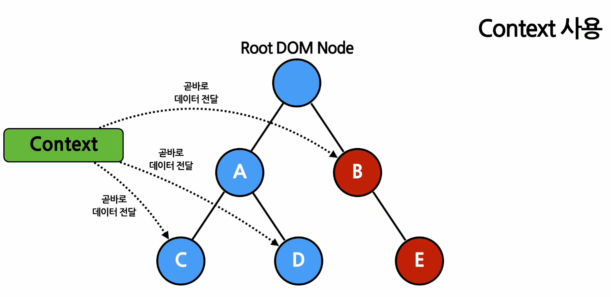
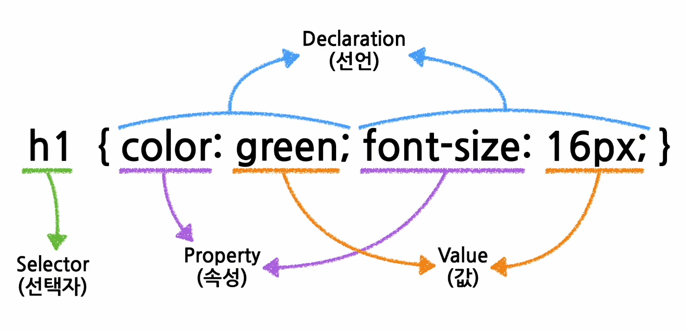

# 프론트엔드 스터디 2주차

## Conditional Rendering
조건부 렌더링 - 어떠한 조건에 따라서 렌더링이 달라지는 것

#### Truthy Falsy
true는 아니지만 true로 여겨지는 값 {}, [], number(not zero), string(not zero)  
false는 아니지만 false로 여겨지는 값 zero, 0n(BigInt zero), empty string, null, undefined, NaN(Not a Number)

#### Element Variables(엘리먼트 변수)
리액트의 엘리먼트를 변수처럼 다루는 방법

#### Inline Condition
조건문을 코드안에 집어넣는 것
Inline if(&& 연산자를 사용)
true && expression -> expression  
false && expression -> false(expression은 평가하지 않음 어짜피 false 니까)   
Inline if-else(? 연산자 사용)  
condition ? true : false  
Component를 렌더링하고 싶지 않으면 null을 리턴한다.

## List and keys
Array(배열) - 변수나 객체들을 하나의 변수로 묶어놓은 것  
Key -- 각 객체나 아이템을 구분할 수 있는 고유한 값(문자열)  
같은 컴포넌트를 반복적으로 나타내야 할 경우,동적으로 변할 경우 - map() 함수 사용  
map() 함수 안에 있는 elements는 꼭 key가 필요하다  
```
const doubled = numbers.map((number) => number * 2);
```
Key의 값은 같은 List에 있는 Elements사이에서만 고유한 값이면 된다.(두 List 사이에서는 Key가 같아도 상관없음)

## Form
사용자로부터 입력을 받기 위해 사용
#### Controlled Components
값이 리액트의 통제를 받는 input form elements  
사용자의 입력을 직접적으로 제어할 수 있음  
#### TextArea 태그
value에 값을 넣어 text 표시
#### select 태그
Drop-down 목록을 보여주기 위한 HTML 태그, 현재 선택된 attribute는 selected라는 속성이 있음  
#### file input 태그
디바이스의 저장 장치로부터 하나 또는 여러 개의 파일을 선택할 수 있게 해주는 HTML 태그  
읽기 전용이기 때문에 값이 리액트에 통제를 받지 않는다.
#### Miltiple input
여러 개의 state 사용

## Shared State(공유된 State)
State에 있는 데이터를 여러 개의 하위 컴포넌트에서 공통적으로 사용하는 경우  
-> 하위 컴포넌트가 공통된 부모 컴포넌트의 state를 공유하여 사용하는 것  

## Composition vs Inheritance
#### Composition(합성)
여러 개의 컴포넌트를 합쳐서 새로운 컴포넌트를 만들어 내는 것  
여려개의 컴포넌트들을 어떻게 조합할 것인가 ?  
-> Containment(포함) : 하위 컴포넌트를 포함하는 형태의 합성 방법.  
-> Specialization(특수화) : 범용적인 개념을 구별이 되게 구체화하는 것

#### Inheritance(상속)
다른 컴포넌트로부터 상속을 받아서 새로운 컴포넌트를 만드는 것  
--> 리액트에서는 잘 안쓰고, Composition을 많이 사용한다 !

## Context
데이터를 기존의 props로 전달하는 대신, 컴포넌트 트리를 통해 곧바로 컴포넌트로 전달하는 방식 제공


로그인 여부, UI테마, 현재 선택 언어 등, 접근이 자주 일어나는 컴포넌트들은 Context를 사용하면 편리하다.  
Context 생성
```
const MyContext = React.createContext(기본값);
```
상위 레벨에 매칭되는 provider가 없다면 기본값, 기본값을 undefined로 넣으면 기본값이 사용되지 않는다.  
Provider - 데이터를 제공해주는 컴포넌트
```
<MyContext.Provider value={/* some value */}>
```
Context.Consumer - 컨텍스트의 데이터를 구독하는 컴포넌트  
function as a child - 컴포넌트의 자식으로 함수를 사용하는 방법  
context.displayName - displayname이 표시됨 , MyContext.Provider 이면 MyDisplayName.Provider로 표시됨
useContext() Hook - 함수 컴포넌트에서 context를 쉽게 사용할 수 있게 해줌 (파라미터로 context 객체를 넣어줘야 함 !)

## Styling
#### CSS(Cascading Style Sheets)
스타일링을 위한 언어, Selector(엘리먼트에 스타일이 적용되는 규칙)와 스타일로 이루어져 있다.  

* Element selector - 특정 HTML 태그를 선택하기 위한 셀렉터
* ID selector - 엘리먼트의 아이디를 정의할 수 있는데, ID를 기반으로 선택한다.(고유하기 때문에 하나의 엘리먼트에 사용
* class selector - 여러개의 엘리먼트를 분류하기 위해 사용
* Universal selector - 전체 엘리먼트에 적용하기 위해 사용 ( * 사용)
* Grouping selector - 여러가지 선택자를 그룹으로 묶어 하나의 스타일을 적용하기 위해 사용
* Element의 상태와 관련된 selector - hover, acrive, focus, checked, first-child, last-child 등 상태에 관한 selector

## Layout
화면에 element들을 어떻게 배치할 것인가 ?  

#### display 속성
* display: none; - element를 화면에서 숨기기 위해사용(js 코드를 넣을 때 사용)
* display: block; - 블록 단위로 element를 배치(p, div, h1~h6)
* display: inline; - element를 라인 안에 넣는 것(span)
* display: flex; - element를 블록 레벨의 flex container로 표시
* 
#### visibility 속성
* visibility: visible; - element를 화면에 보이게 하는 것
* visibility: hidden; - 화면에서 안 보이게 감추는 것( elment를 안 보이게만 하고, 화면에서의 영역은 그대로 차지 )
*   
#### position 속성
* static - 기본값으로 element를 원래의 순서대로 위치시킴
* fixed - element를 브라우저 window에 상대적으로 위치시킴
* relative - element를 보통의 위치에 상대적으로 위치시킴
* absolute - element를 절대 위치에 위치시킴

#### 가로, 세로 길이와 관련된 속성
width, height, min,max width height 등

### Flexbox
다양한 레이아웃을 자유롭게 구성하는 데에 불편함을 해소하기 위해 나옴  

#### flex-direction 속성
* row - 기본값. 행을 따라 가로 순서대로 왼쪽부터 배치
* column - 열을 따라 세로 순서대로 위쪽부터 배치
* row-reverse - 행의 역방향으로 오른쪽으로 배치
* column-reverse - 열의 역방향으로 아래쪽부터 배치

#### align-itmes 속성 (아이템들의 간격)
* stretch - 기본값. 아이템을 늘려서 컨테이너를 가득 채움
* flex-start - cross axis의 시작 지점으로 아이템을 정렬
* center - cross axis의 중앙으로 아이템을 정렬
* flex-end - cross axis의 끝 지점으로 아이템을 정렬
* baseline - baseline 기준으로 정렬

#### justify-content 속성 (아이템 사이의 간격)
* flex-start - main axis의 시작 지점으로 아이템을 맞춤
* conter - main axis의 중앙으로 아이템을 맞춤
* flex-end - main axis의 끝 지점으로 아이템을 맞춤
* space-between - main axis 기준으로 첫 아이템을 시작 지점에 맞추고 마지막 아이템을 끝 지점에 맞추며, 중간에 있는 아이템들 사이 간격이 일정하게 되도록 맞춤
* space-around - main axis 기준으로 각 아이템의 주변 간격을 동일하게 맞춤

## font
글꼴 설정. font-family: Arial 이런식으로 사용
#### 글꼴 분류
* serif - 각 글자의 모서리에 작은 테두리를 갖고 있는 형태의 글꼴
* sans-serif - 모서리에 테두리가 없어 깔끔한 선을 가진 글꼴, serif보다 가독성이 좋음
* monospace - 모든 글자가 같은 가로 길이를 가지는 글꼴, 코딩할 때 주로 사용
* cursive - 사람이 쓴 손글씨 모양의 글꼴
* fantasy - 장식이 들어간 형태의 글꼴
그 외에도 font-size, font-weight, font-style 속성이 있음
